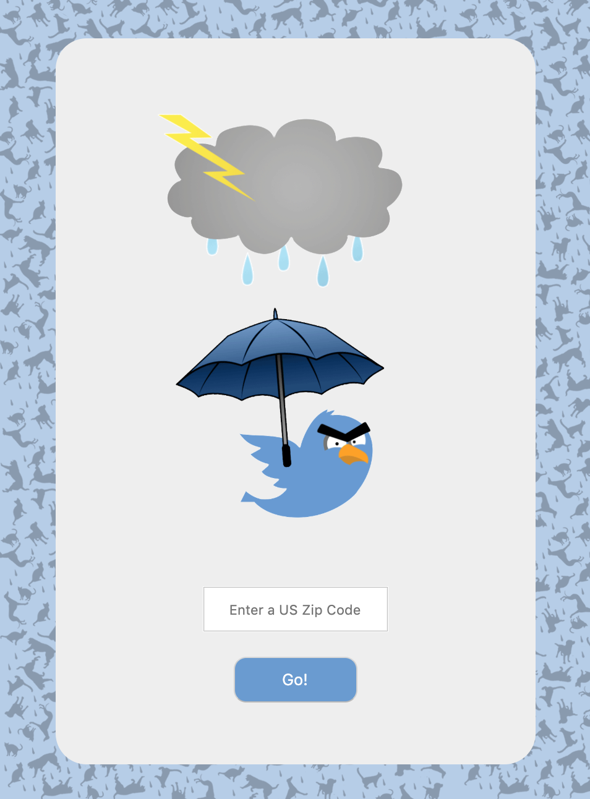

A Cat, A Dog, and a Ticked Off Bird

Live App: https://amy-braswell.github.io/a_cat_a_dog_and_a_ticked_off_bird/

Summary:
This app will let you see current weather conditions from three separate weather api's for a US Zip Code, specified by the user. The results will be returned without the weather api's name displayed to prevent bias.

Motivation: 
I wanted to build an app that would return weather conditions from more than one source to have a better estimate of the actual weather conditions. I also wanted the user to be able to reveal the name of the weather api that they feel is most accurate so they can gain a sense of the best weather api to use for their area.

Technology:
This app was built with HTML, CSS, JavaScript, jQuery and Fetch.